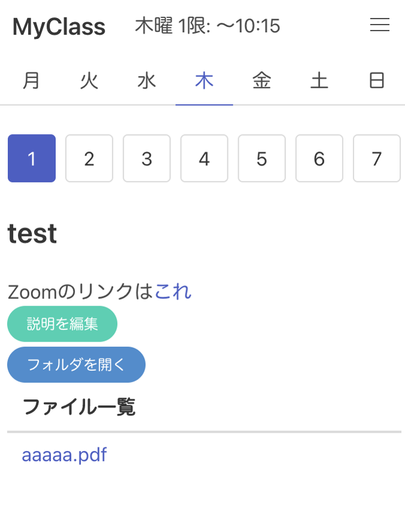
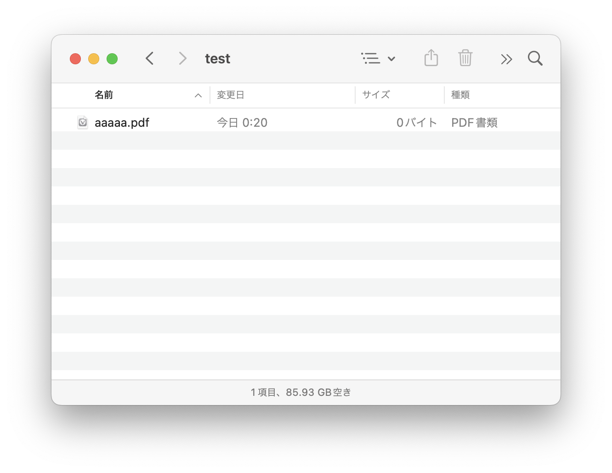

# my-class-pdf

設定したフォルダ内のpdfファイルの一覧をブラウザで表示するだけのアプリです。

時間によって表示するフォルダを変えられます。
また、Markdownでメモ書きやリンクなどを表示することもできます




Macでしか動作確認してませんがwindowsやlinuxでもうごくはず

## 使い方

* 必要なパッケージ: flaskとmarkdownのインストール(またはpipenvを使ってる人はPipfileを使用)
```bash
pip3 install flask markdown
```
* pythonで`import tkinter`が使えることを確認(参考: https://stackoverflow.com/questions/63643687/import-tkinter-if-this-fails-your-python-may-not-be-configured-for-tk-error-i)
* サーバー起動(pipenvでは`pipenv run start`)
  * macだとデフォルトの5000は使えないっぽいので8000を指定した
```bash
flask run --port 8000
```
* ブラウザで http://127.0.0.1:8000/ を開く
  * タブとして開いて使えるが、Vivaldiだったらパネルに登録すると便利
* 開いたら右上の「Config」ボタンを押して時間とフォルダを設定する
